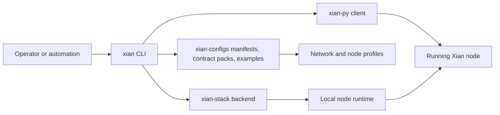

# xian-cli

`xian-cli` is the operator-facing and automation-facing control plane for
Xian. It owns manifests, node profiles, lifecycle commands, health checks,
local bootstrap flows, and JSON-first client commands without turning
`xian-abci`, `xian-py`, or `xian-stack` into user-facing tools.

The published PyPI package is `xian-tech-cli`. The installed console command
remains `xian`. Runtime-heavy commands expect access to `xian-stack` and
canonical manifests from `xian-configs`, either through the default sibling
workspace layout or explicit `--stack-dir` and `--configs-dir` flags.

## Control Plane



## Quick Start

Local development in a sibling-repo workspace:

```bash
uv sync --group dev
uv run xian --help
```

Isolated operator install from a published release:

```bash
uv tool install xian-tech-cli
xian --help
```

Bootstrap installer (requires `uv`):

```bash
curl -fsSL https://raw.githubusercontent.com/xian-technology/xian-cli/main/scripts/install.sh | sh
```

Windows PowerShell:

```powershell
irm https://raw.githubusercontent.com/xian-technology/xian-cli/main/scripts/install.ps1 | iex
```

Set `XIAN_CLI_VERSION` before either installer to pin a specific release.

### Common Workflows

Guided node setup:

```bash
uv run xian setup node
```

For scripted review without changing files:

```bash
uv run xian setup node --mode join --network testnet --name validator-1 --plan
```

Create a local network from a template:

```bash
uv run xian network template list
uv run xian network create local-dev --chain-id xian-local-1 \
  --template single-node-dev --generate-validator-key --init-node
uv run xian node start local-dev
uv run xian node status local-dev
```

For a metered 0-fee local network, add `--tx-fee-mode free_metered` plus
explicit `--free-tx-max-chi` and `--free-block-max-chi` caps to `setup node`,
`network create`, or `network join`.

Block production defaults come from the selected network template or manifest.
For on-demand local development, use `--block-policy-mode on_demand`; for
scheduled empty blocks, pass both a mode and empty-block interval:

```bash
uv run xian setup node --mode local --network local-dev \
  --block-policy-mode periodic --block-policy-interval 1s
```

The interval controls CometBFT empty-block scheduling. It is not an exact
finalized block-time target: observed cadence is still bounded by normal
CometBFT consensus timing, especially `timeout_commit`, and block execution
time.

Join a manifest-backed shared network with a local profile:

```bash
uv run xian network join devnet-node --network devnet \
  --template single-node-indexed --generate-validator-key \
  --init-node --restore-snapshot
uv run xian node health devnet-node
uv run xian node endpoints devnet-node
```

Package a clean operator handoff bundle for a network manifest:

```bash
uv run xian network package-operator-bundle devnet \
  --bootstrap-seed '<node_id>@<public-host>:26656' \
  --archive
```

Inspect or recover a configured node:

```bash
uv run xian doctor devnet-node
uv run xian doctor devnet-node --skip-live-checks
uv run xian snapshot restore devnet-node
```

For remote snapshot bootstrap, prefer a signed snapshot manifest plus trusted
snapshot signing keys in the network manifest or node profile.

Wallet, query, and transaction automation against a running node:

```bash
uv run xian client wallet generate --include-private-key
uv run xian client query nonce --node-url http://127.0.0.1:26657 <address>
uv run xian client tx transfer \
  --node-url http://127.0.0.1:26657 \
  --private-key-env XIAN_PRIVATE_KEY \
  <recipient> 1.25
```

## Operator Journeys

Use `xian-cli` when you want a stable human-facing command surface. The CLI
reads committed assets from `xian-configs`, delegates runtime-heavy local
operations to `xian-stack`, and uses `xian-py` for wallet / RPC automation.

| Goal | Primary commands | Backing repo |
| --- | --- | --- |
| Create a local network | `xian network template ...`, `xian network create ...` | `xian-configs`, `xian-abci` |
| Join an existing network | `xian network join ...` | `xian-configs`, `xian-stack` |
| Guided node setup | `xian setup node` | `xian-cli`, `xian-configs`, `xian-stack` |
| Package operator handoff | `xian network package-operator-bundle ...` | `xian-cli`, `xian-configs` |
| Operate a node | `xian node start/status/health/endpoints/stop ...` | `xian-stack` |
| Diagnose a setup | `xian doctor ...`, `xian snapshot restore ...` | `xian-stack`, `xian-abci` |
| Install reusable contracts | `xian contract-pack list/show/validate/install ...` | `xian-configs` contract packs |
| Inspect full app starters | `xian example list/show/starter ...` | `xian-configs` examples |
| Script chain interactions | `xian client query/call/simulate/tx ...` | `xian-py` |

Typical local development loop:

```bash
uv run xian network template show single-node-indexed
uv run xian network create local-indexed \
  --chain-id xian-local-indexed-1 \
  --template single-node-indexed \
  --generate-validator-key \
  --init-node
uv run xian node start local-indexed
uv run xian node health local-indexed
uv run xian node endpoints local-indexed
```

Install and smoke a reusable contract pack:

```bash
uv run xian contract-pack list
uv run xian contract-pack show dex
uv run xian contract-pack validate dex
uv run xian contract-pack install dex \
  --rpc-url http://127.0.0.1:26657 \
  --deployer-private-key "$XIAN_PRIVATE_KEY" \
  --top-up-liquidity \
  --emit-test-swap
```

Inspect a complete starter flow before creating files or running installers:

```bash
uv run xian example list
uv run xian example show dex-demo
uv run xian example starter dex-demo --flow local
```

Validate a hash-pinned contract bundle directly:

```bash
uv run xian contract bundle validate ../xian-dex/contract-bundle.json
```

Build Xian VM deployment artifacts from source for SDKs or CI:

```bash
uv run xian contract build-artifacts ./contracts/con_counter.s.py \
  --output ./dist/con_counter.artifacts.json
```

Submit prebuilt deployment artifacts through the same signed transaction
surface as other client automation:

```bash
uv run xian client tx submit-artifacts ./dist/con_counter.artifacts.json \
  --node-url http://127.0.0.1:26657 \
  --private-key-env XIAN_PRIVATE_KEY \
  --mode commit
```

For scripts and CI, prefer commands that emit JSON and avoid parsing human
status text:

```bash
uv run xian client query balance \
  --node-url http://127.0.0.1:26657 \
  <address>
```

## Principles

- **Operator UX lives here.** Deterministic node logic stays in `xian-abci`,
  and local runtime orchestration stays in `xian-stack`. This repo is the
  control plane that ties them together.
- **Explicit artifacts, not hidden state.** Manifests and node profiles are
  human-readable files. The CLI inspects, generates, and updates them; it
  does not invent state outside them.
- **Templates accelerate, never lock in.** Templates, contract packs, and examples
  shorten common setups, but an operator who knows what they are doing should
  still be able to work directly with manifests, profiles, and node homes.
- **Diagnostics are first-class.** Health, endpoint discovery, and `doctor`
  paths are core features, not afterthoughts.
- **JSON-first for automation.** Client commands and inspection commands emit
  machine-readable output suitable for scripts and CI.

## Key Directories

- `src/xian_cli/` — commands, models, manifest handling, and backend
  integration.
  - `cli.py`, `parser.py` — argument parsing and command dispatch.
  - `client/` — wallet, query, call, simulate, and transaction commands.
  - `config_repo.py`, `models.py` — manifest and profile schemas.
  - `abci_bridge.py`, `runtime.py` — node-runtime integration.
  - `contract_bundles.py` — hash-pinned contract-bundle validation.
- `scripts/` — install / packaging helpers (e.g. `install.sh`, `install.ps1`).
- `tests/` — CLI behavior and manifest / profile validation coverage.
- `docs/` — architecture, lifecycle contract, distribution notes, backlog.

## Capabilities

- key generation and validator material
- network template, contract-pack, and example discovery
- network creation and network join flows
- node initialization, start, stop, and status
- endpoint and health discovery, including optional dashboard, monitoring,
  and stack-managed `xian-intentkit` / `xian-dex-automation`
- snapshot restore and doctor diagnostics
- contract-pack install / validation flows backed by `xian-configs`
- example starter flows backed by `xian-configs`
- Xian VM deployment artifact generation from contract source
- hash-pinned contract-bundle validation
- wallet, query, call / simulate, and transaction automation via `xian-py`

## Command Groups

- `xian keys ...` — generate validator and account material
- `xian setup node` — guided wrapper for local node creation or network join
- `xian network template ...` — inspect reusable network templates
- `xian network create ...` — create a local / operator-managed network profile
- `xian network join ...` — join an existing manifest-backed or remote network
- `xian network package-operator-bundle ...` — package a shareable operator handoff
- `xian node ...` — initialize, start, stop, inspect, and recover a node profile
- `xian client ...` — wallet, query, call / simulate, and transaction automation
  including artifact-backed contract submission
- `xian contract-pack ...` — inspect, validate, and install reusable contract packs
- `xian example ...` — discover guided application / operator starter flows
- `xian contract build-artifacts ...` — build Xian VM deployment artifacts
- `xian contract bundle ...` — validate hash-pinned contract bundles
- `xian doctor ...` — run broader local diagnostics

## Validation

```bash
uv sync --group dev
uv run ruff check .
uv run ruff format --check .
uv run pytest
```

## Related Docs

- [AGENTS.md](AGENTS.md) — repo-specific guidance for AI agents and contributors
- [docs/README.md](docs/README.md) — index of internal docs
- [docs/ARCHITECTURE.md](docs/ARCHITECTURE.md) — major components and dependency direction
- [docs/BACKLOG.md](docs/BACKLOG.md) — open work and follow-ups
- [docs/LIFECYCLE_CONTRACT.md](docs/LIFECYCLE_CONTRACT.md) — node-lifecycle contract that the CLI enforces
- [docs/DISTRIBUTION.md](docs/DISTRIBUTION.md) — packaging, install paths, and release-channel rules
