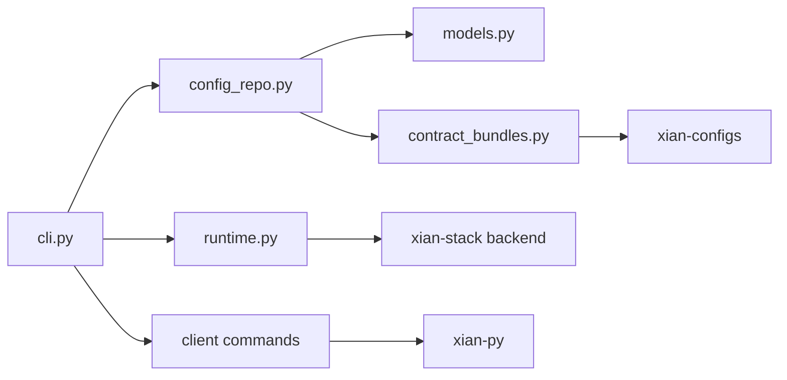

# xian_cli

## Purpose

This package contains the `xian-cli` command surface and the supporting models
behind network manifests, node profiles, and backend integration.

## Contents

- `cli.py`: the top-level command parser and workflow implementation
- `client/`: automation-oriented wallet/query/transaction commands backed by
  `xian-py`
- `models.py`: typed manifest, profile, and related config models
- `config_repo.py`: canonical network/template/module/solution resolution
- `contract_bundles.py`: hash-pinned contract bundle validation helpers
- `runtime.py`: local runtime backend integration
- `abci_bridge.py`: direct integration points with backend node tooling

## Notes

- Keep this package orchestration-focused.
- The `xian client ...` namespace is the supported place for JSON-first end
  user automation without duplicating SDK logic.
- Reusable deterministic node logic belongs in `xian-abci`.
- Docker/runtime implementation details belong in `xian-stack`.
- This package should describe operator workflows clearly even when those
  workflows delegate to sibling repos.
