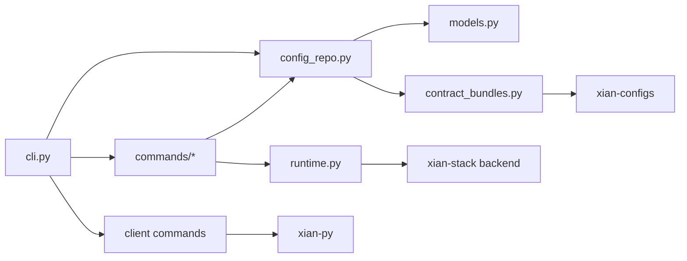

# xian_cli

## Purpose

This package contains the `xian-cli` command surface and the supporting models
behind network manifests, node profiles, and backend integration.

## Contents

- `cli.py`: the top-level command parser and workflow implementation
- `commands/`: focused command implementations
  - `catalog.py`: template, contract-pack, example, contract, and key commands
  - `network.py`: network create/join and operator bundle packaging
  - `node.py`: node init/start/stop/status/endpoints/health and snapshots
  - `node_context.py`: shared profile, genesis, key, home, and snapshot helpers
  - `recovery.py`: recovery plan validation and application
  - `doctor.py`: workspace and node diagnostics
  - `common.py`: small shared formatting and runtime-option helpers
- `client/`: automation-oriented wallet/query/transaction commands backed by
  `xian-py`, including artifact-backed contract submission
- `models.py`: typed manifest, profile, and related config models
- `config_repo.py`: canonical network/template/contract-pack/example resolution
- `contract_bundles.py`: hash-pinned contract bundle validation helpers
- `contract build-artifacts`: command surface for compiler-backed deployment
  artifact generation
- `runtime.py`: local runtime backend integration
- `abci_bridge.py`: direct integration points with backend node tooling

## Notes

- Keep this package orchestration-focused.
- The `xian client ...` namespace is the supported place for JSON-first end
  user automation without duplicating SDK logic.
- Reusable deterministic node logic belongs in `xian-abci`.
- Docker/runtime implementation details belong in `xian-stack`.
- This package should describe operator workflows clearly even when those
  workflows delegate to sibling repos.
